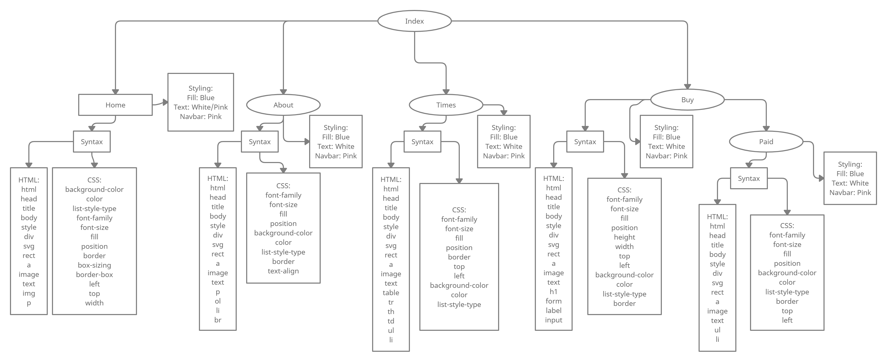

# **PROJECT #1 - CISC 3141 (Fall 2021)**

This is not group work: The first project is to be done individually. 
Instructions for Submission: Remote Submission 
Submit all your code on GitHub. Create a repository with the class name and specify “First Project”
(CISC3141_FirstProject). Submit the link with the email subject line “firstName_lastName_course” of
your repository to my email at: sumaiya.tabassum@brooklyn.cuny.edu
by Sunday October 17, 2021, 11:59pm EST. 
Along with the GitHub repository link, be sure to attach the following project submission (“hard-copy”)
in pdf or word document.  

### Submission Requirements:
1st page: Project proposal/problem statement 
2nd page: Outline 
3rd page: Diagram 
4th page: Screenshot of your website/webpage  

### Grading: 
**Project #1 is 20% of your overall course grade. The project itself will be graded out of 100 points. Below is the grade breakdown of the project out of 100 points:** 
1. Project Proposal/Problem Statement: 10% - I will not be assigning what the project theme will be.
It is up to you to present clearly on a single page what your website/webpage is about and the
inspiration behind it.
2. Outline: 20% - Please be clear in your outline. Yes, an outline will not say everything word by
word about your website/webpage, however, it should be readable, understandable, and clear.
Make sure there is a clear and logical flow in your outline.
3. Diagram: 20% - Translate your outline into a diagram (we did a few examples in class). Make
sure there is a logical flow.
4. Code: 50% - Use all tags covered in class and additional tags not covered in class. - Tags covered
in class, excluding the necessary tags (e.g. html, head, body, title) were: p, a, h1, h2, h3, h4, h5,
h6, div, ol, ul, li, br, table, img - For tags: h1, h2, h3, h4, h5, h6, you do not have to use all of
them unless you want to - Use additional tags not covered in class - Use inline, internal, and
external css – All three types is a must. Also, please be sure to have good file structure. Keep
your css in a separate file as well as you image(s) in a separate file.

### Some Project Suggestions:
Below are a few suggestions for your first project. You can choose something else if you wish.
1. Blog Page
2. Landing Page
3. New Product Launch Page
4. Information Page    

#	Site Description 
Have you ever seen on of those as seen on TV ads that promotes a product which asks a dim-witted and nonsensical problem that the product intends to solve and the product ends up not working at all. (Example: https://www.youtube.com/watch?v=RoG0vv-twCA) An idea that is a complete and utter scam just to grab as much money as possible. That’s where the idea of my project started, I wanted to create a website that simulated this. After I thought of the idea that we all have as kids, where if we were to dig a whole to the other side of the planet where would we be. This idea is called an antipode and has a decent amount of work and research on it. So, with these two ideas combined I built my site, “The Pit”. 

The site sells you the idea of traveling through a pit from one side of the planet to another. I used a website I found in order to find an antipode to use for the site and I found one between Christchurch, New Zealand and A Coruña, Spain. Then I fleshed out the site to include multiple pages which can be accessed via the navbar. The home page is there to suck you in and buy immediately without knowing what the product even is. The about page actually explains what is going on. The times page shows a table with the location of the antipodes and the times when to jump. Finally, the buy page is a mock purchasing form which leads you to a buy page congratulating you on the purchase.  

## Outline
- Index
- - Home
- - - Syntax
- - - - HTML
- - - - - html
- - - - - head
- - - - - title
- - - - - body
- - - - - style
- - - - - div
- - - - - svg
- - - - - rect
- - - - - a
- - - - - image
- - - - - text
- - - - - img
- - - - - p
- - - - CSS
- - - - - background-color
- - - - - color
- - - - - list-style-type
- - - - - font-family
- - - - - font-size
- - - - - fill
- - - - - position
- - - - - border
- - - - - box-sizing
- - - - - border-box
- - - - - left
- - - - - top
- - - - - width
- - - Styling
- - - - Fill: Blue
- - - - Text: White/Pink
- - - - Navbar: Pink
- - About
- - - Syntax
- - - - HTML
- - - - - html
- - - - - head
- - - - - title
- - - - - body
- - - - - style
- - - - - div
- - - - - svg
- - - - - rect
- - - - - a
- - - - - image
- - - - - text
- - - - - p
- - - - - ol
- - - - - li
- - - - - br
- - - - CSS
- - - - - background-color
- - - - - color
- - - - - list-style-type
- - - - - font-family
- - - - - font-size
- - - - - fill
- - - - - position
- - - - - border
- - - - - text-align
- - - Styling
- - - - Fill: Blue
- - - - Text: White
- - - - Navbar: Pink
- - Times
- - - Syntax
- - - - HTML
- - - - - html
- - - - - head
- - - - - title
- - - - - body
- - - - - style
- - - - - div
- - - - - svg
- - - - - rect
- - - - - a
- - - - - image
- - - - - text
- - - - - table
- - - - - tr
- - - - - th
- - - - - td
- - - - - ul
- - - - - li
- - - - CSS
- - - - - background-color
- - - - - color
- - - - - list-style-type
- - - - - font-family
- - - - - font-size
- - - - - fill
- - - - - position
- - - - - border
- - - - - top
- - - - - left
- - - Styling
- - - - Fill: Blue
- - - - Text: White
- - - - Navbar: Pink
- - Buy
- - - Syntax
- - - - HTML
- - - - - html
- - - - - head
- - - - - title
- - - - - body
- - - - - style
- - - - - div
- - - - - svg
- - - - - rect
- - - - - a
- - - - - image
- - - - - text
- - - - - h1
- - - - - form
- - - - - label
- - - - - input
- - - - CSS
- - - - - background-color
- - - - - color
- - - - - list-style-type
- - - - - font-family
- - - - - font-size
- - - - - fill
- - - - - position
- - - - - border
- - - - - top
- - - - - left
- - - - - height
- - - - - width
- - - Styling
- - - - Fill: Blue
- - - - Text: White
- - - - Navbar: Pink
- - - Paid
- - - - Syntax
- - - - - HTML
- - - - - - html
- - - - - - head
- - - - - - title
- - - - - - body
- - - - - - style
- - - - - - div
- - - - - - svg
- - - - - - rect
- - - - - - a
- - - - - - image
- - - - - - text
- - - - - - ul
- - - - - - li
- - - - - CSS
- - - - - - background-color
- - - - - - color
- - - - - - list-style-type
- - - - - - font-family
- - - - - - font-size
- - - - - - fill
- - - - - - position
- - - - - - border
- - - - - - top
- - - - - - left
- - - - Styling
- - - - - Fill: Blue
- - - - - Text: White
- - - - - Navbar: Pink

### Diagram

